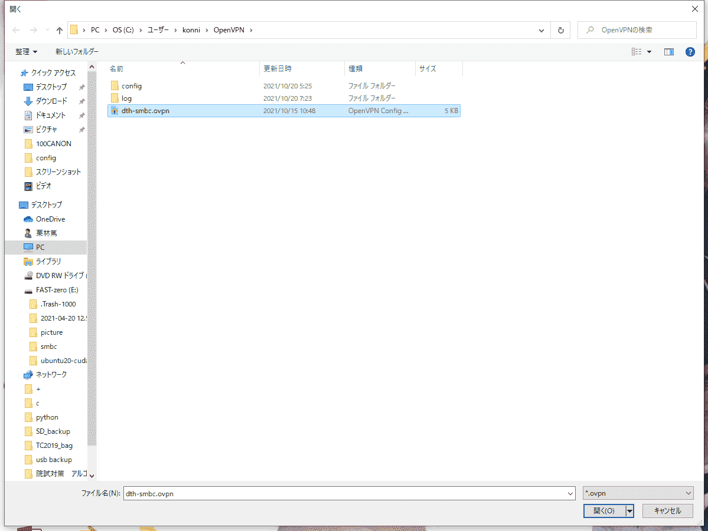
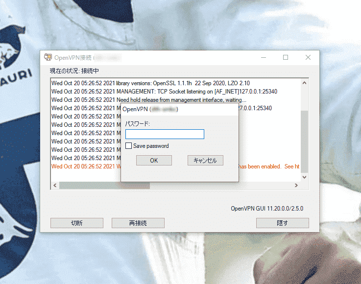
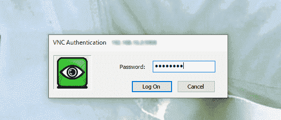
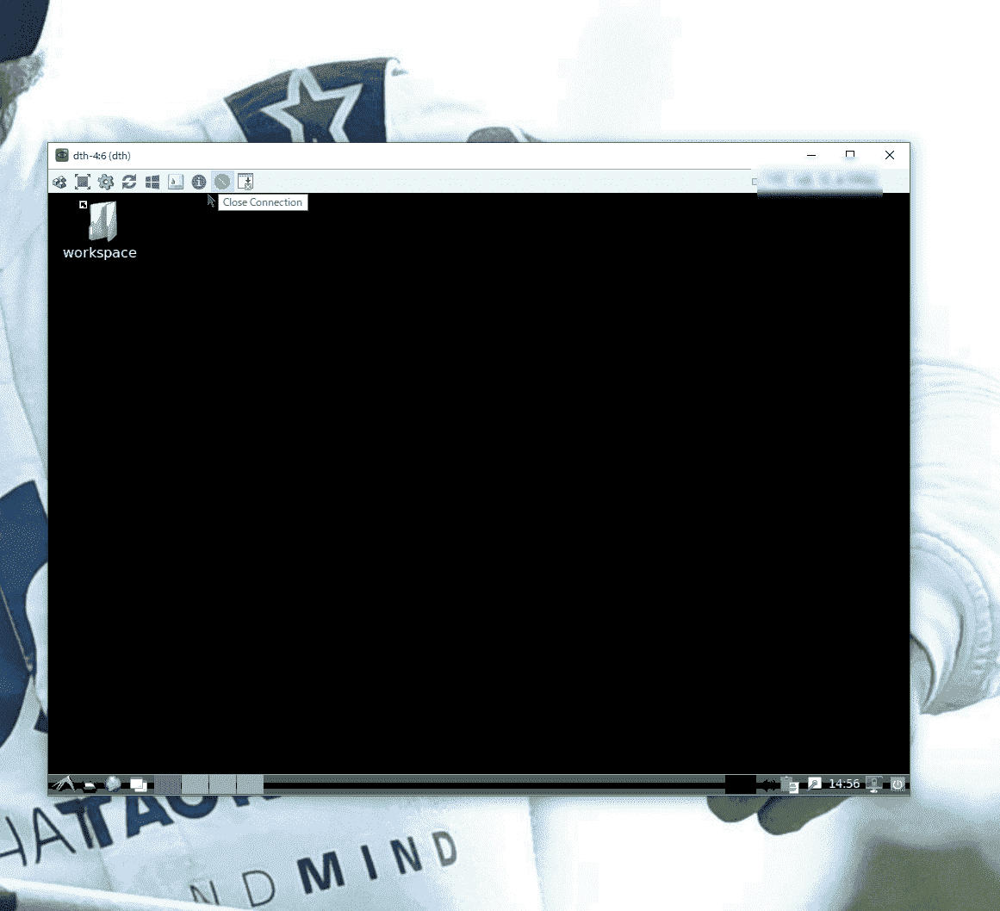

# セットアップ方法

## 認証鍵受け取り
key/dth-smbc.ovpn : vpnアクセス鍵。取扱は厳重にお願いします。絶対に外部に置かないようにしてください。
memo.txt : VPNパスワードとVNCパスワード
access.xlsx : VNCにアクセスするために個人に振り分けられたIPアドレスとポート番号

## ソフトウェアインストール
### Windows
* OpenVPN
* VNCクライアントビューワー (UltraVNC等)

### Mac
* OpenVPN
* VNCクライアントビューワー(RealVNC等)

### Linux
* OpenVPN
* VNCクライアントビューワー(TigerVNC等)

## VPN接続
作業PCのあるネットワークに接続します。  
送付されたVPN公開鍵を自分のPCへ保存してください。

>**公開鍵の取り扱いには十分注意してください**  
クラウドやチャットツールにアップロードすることの無いよう注意してください。  
 Windowsの場合、`ドキュメント`などへ保存するとOneDriveへ共有されてしまう可能性があるため、`¥C:/Download/vpn`など、¥C：下のローカルストレージへ保存するように注意してください。

1. OpenVPNに公開鍵をインポートします

2. VPNへ接続します

VPNネットワークのパスワードを入力してください。

3. それっぽいダイアログが出てきたら接続完了です。ipアドレスは`10.8.0.xx`になっているはずです。

## VNC接続
作業環境PCへアクセスします。  

1. VNCクライアントアプリを起動してください

2. VNCの接続設定をします

* Server:port  
各グループに割り振られたPCのIPアドレスと、ご自身のポート番号を入力してください。  
`IPアドレス:ポート番号`
* 接続オプション  
エンコードは`ZRLE`, `32(64)Colors`, `Jpeg Quality=5~8` がおすすめです。

3. VNCパスワードを入力してください。

4. 画面が出てくれば接続成功です。少しデスクトップの表示に時間がかかるかもしれません。30秒程何も表示されなかったら、問い合わせてください。作業環境詳細については[hands_on](https://github.com/kuriatsu/rwdc-remotework-manual/blob/main/hands_on.md)を参照。

## データアクセス
提供データは暗号化されたHDDに格納されています。
デスクトップのリンク`workspace`からアクセスすることができます。
パスは`/home/自分の名前/Desktop/workspace/data`
です。

作業に関する詳細は[hands_on](https://github.com/kuriatsu/rwdc-remotework-manual/blob/main/hands_on.md)をご参照。

## 作業終了
1. VNCの切断ボタン (`Close Connection`)
2. VPN切断  

VPNへ接続すると、全てのトラフィックは作業環境ルータを経由します。  
VPN接続したままYouTube等を行うと、帯域が圧迫されて、他の作業者の通信が遅くなってしまう可能性があるので、作業が終わったら必ず切断して下さい。
